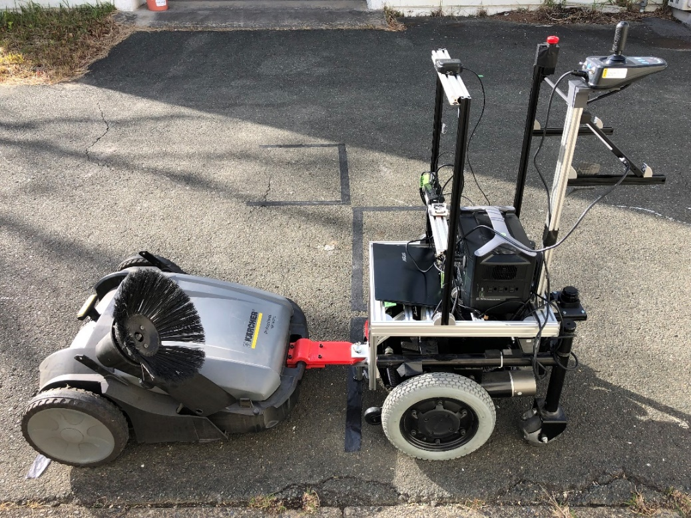
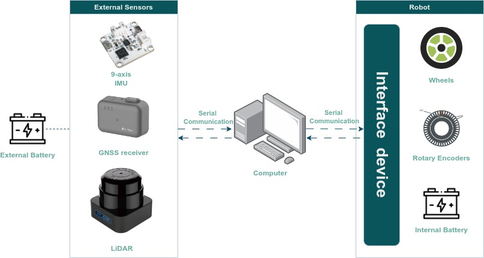
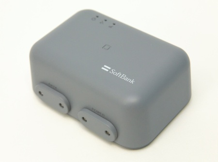
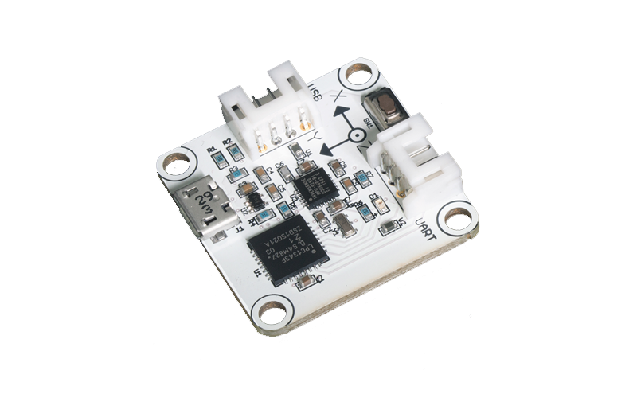
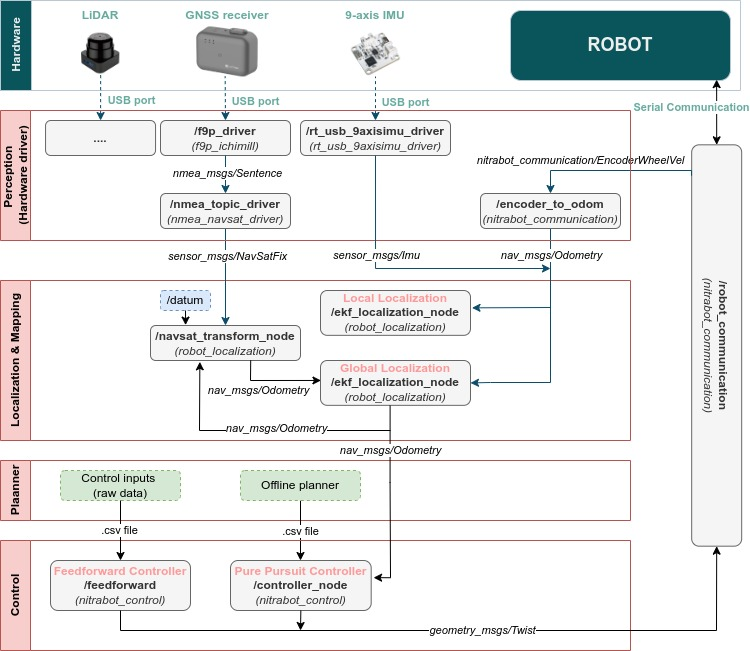

# nitrabot_ws
A ROS workspace contains essential packages for running Nitrabot with various hardwares. 

This workspace is partially written by TUT-Systems Engneering Labroratory members and being used only for research purpores.



### **Table of contents**

- [nitrabot\_ws](#nitrabot_ws)
    - [**Table of contents**](#table-of-contents)
  - [Hardware Configuration](#hardware-configuration)
    - [GNSS device](#gnss-device)
    - [IMU sensor](#imu-sensor)
    - [LiDAR](#lidar)
    - [Robot control system](#robot-control-system)
  - [Software configuration](#software-configuration)
    - [Localization \& Mapping](#localization--mapping)
    - [Path planner](#path-planner)
    - [Path following controller](#path-following-controller)
  - [Manual for running nitrabot](#manual-for-running-nitrabot)
    - [Setting up the enviroment](#setting-up-the-enviroment)
    - [Starting up the system with hardware](#starting-up-the-system-with-hardware)
    - [Scenario 1: Feedforward control](#scenario-1-feedforward-control)
    - [Scenario 2: Feedback control with pure pursuit controller](#scenario-2-feedback-control-with-pure-pursuit-controller)


## Hardware Configuration




### GNSS device
A Global Navigation Satellite System (GNSS) is a satellite configuration, or constellation, that provides coded satellite signals which are processed by a GNSS receiver to calculate position. 

GNSS system is typically only able to provide a positioning accuracy on the order of several of meters. To get better accuracy, [Ichimill service ](https://www.softbank.jp/biz/services/analytics/ichimill/) provided by SoftBank have been chosen for this project. Simly put, base receivers, which have fixed-location, computes correction information and distribute it via Internet, then it is used by our receiver to correct position obtained from GNSS signal. This system is expected to have a accuracy on the order of several of centimeters.

Since the below GNSS receiver which outputs corrected data is used in this package, [nmea_serial_driver](http://wiki.ros.org/nmea_navsat_driver#:~:text=provides%20velocity%20information.-,nmea_serial_driver,-NMEA%20GPS%20Serial) node is good enough for converting receiver's output (NMEA sentences) into ROS messages (`sensor_msgs/NavSatFix`).

> *In case of using different RTK-GNSS receiver, a package contains nodes for receiving correction information from Ichimill service and sending it to receivers is required. Unofficial package [f9p_ichimill](https://github.com/terakenxx/f9p_ichimill) satisfies this requirement.*



### IMU sensor

An Intertial Measurement Unit (IMU) measures and reports body's specific force (also call proper acceleration), angular rate, magnetic fields using a combination of accelerometers, gycroscopes, and magnetomerters.



[RT_USB_9axisIMU](https://rt-net.jp/products/usb9imu/) sensor is used in this project. IMU data is obtained via USB port, and expressed in ROS by using [rt_usb_9axisimu_driver](https://github.com/rt-net/rt_usb_9axisimu_driver/tree/noetic-devel?tab=readme-ov-file)

> *The bias errors of IMU components should be calibrated manually for better accuracy. Refer to this [manual](https://github.com/rt-net/RT-USB-9AXIS-00/blob/master/manual/USB%E5%87%BA%E5%8A%9B9%E8%BB%B8IMU%E3%82%BB%E3%83%B3%E3%82%B5ver2.0%E3%83%9E%E3%83%8B%E3%83%A5%E3%82%A2%E3%83%AB.pdf) for more information.*

### LiDAR 

*(in progress)*

### Robot control system 

Tractor part of Nitrabot is an autonomous mobile robot (AMR) whose movement is based on two separately driven wheels placed on either side of the robot body. Velocity commands could be sent to robot via the interface device using serial communication.

 [robot_communication](src/nitrabot_communication/src/nitrabot_communication/robot_communication.cpp) node in [nitrabot_communication](src/nitrabot_communication/) package is responsible for commucating with the robot. The velocity command published on `/cmd_vel` topic will be sent to the robot via interface devices. Concurrently, the rotary encoder data and battery's condition also be published respectively into `/encoder` and `/battery` topics.


## Software configuration 



### Localization & Mapping

*(in progress)*

### Path planner 

*(in progress)*

### Path following controller 

*(in progress)*

## Manual for running nitrabot 

### Setting up the enviroment

-----

* **Enable GUI within Docker containers**

  > **! Caution:** This method exposes PC to external source. Therefore, a more secure alternative way is expected for using GUI within Docker containers. This problem was raised in [Using GUI's with Docker](https://wiki.ros.org/es/docker/Tutorials/GUI#:~:text=%2D%2Dpulse.-,Using%20X%20server,-X%20server%20is)

```bash
#This command is required to run every time the PC is restarted
xhost + 
```
Make a X authentication file with proper permissions for the container to use.

```bash
# If not working, try to run "sudo rm -rf /tmp/.docker.xauth" first
cd ./src/nitrabot_dockerfiles/
chmod +x ./install/xauth.sh && ./install/xauth.sh
```

* **Install Docker (optional)** 
 
```bash
chmod +x ./src/docker_installer.sh && ./src/install_docker.sh
```
* **Launch the environment**
  
Start up
```bash
cd ./src/nitrabot_dockerfiles
docker compose up -d 
```

Open a container in interactive mode
```bash
cd ./src/nitrabot_dockerfiles
docker compose exec [name-of-container] bash
```
To stop containers, run
```bash
docker compose down
```

To commit a container to a new image, run
```bash
#Do not do this if you're not familiar with Docker commit action. This changes your docker images.
docker commit [container-id] [image-name:tag]
```
More other useful Docker's CLI can be found in [Docker CLI cheetsheet](https://docs.docker.com/get-started/docker_cheatsheet.pdf)

### Starting up the system with hardware

-----

Start the environment

```bash
docker compose up -d 
```

In terminal 1, run the below to enable sending command to robot and get the wheel encoder data

```bash
docker compose exec robot_communication bash
roslaunch nitrabot_communication nitrabot_communication.launch
```

In terminal 2, run the below to start collect GPS and IMU sensor data

```bash
docker compose exec nitra_robot bash
roslaunch nitrabot_launch bringup.launch
```

### Scenario 1: Feedforward control

-----

In terminal 1 

```bash
docker compose up -d 
docker compose exec robot_communication bash
roslaunch nitrabot_communication nitrabot_communication.launch
```
In terminal 2

```bash
docker compose exec nitra_robot bash
rosrun nitrabot_control feedforward
```

### Scenario 2: Feedback control with pure pursuit controller

-----

In terminal 1 

```bash
docker compose up -d 
docker compose exec robot_communication bash
roslaunch nitrabot_communication nitrabot_communication.launch
```

In terminal 2

```bash
docker compose exec nitra_robot bash
roslaunch nitrabot_launch nav_pure_pursuit.launch
```
